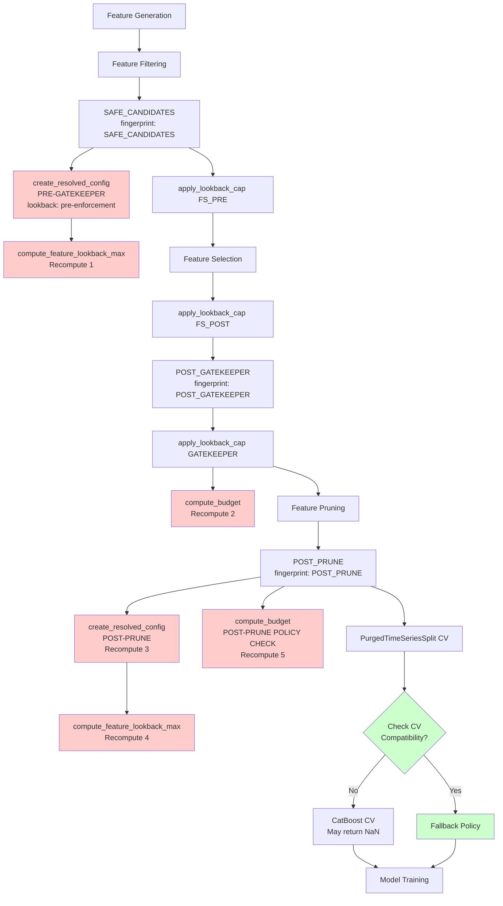
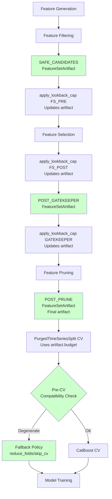
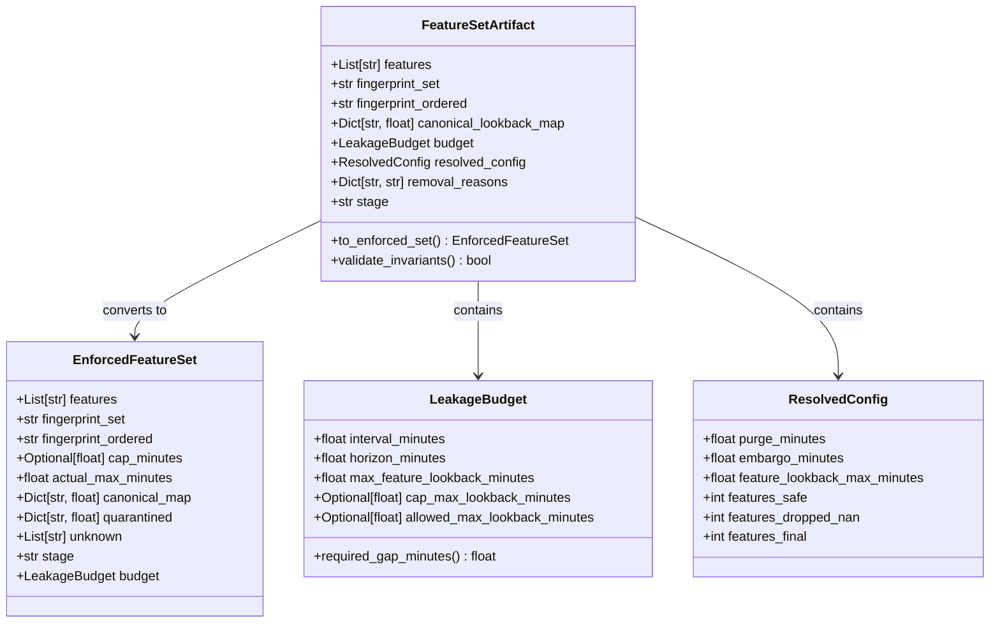
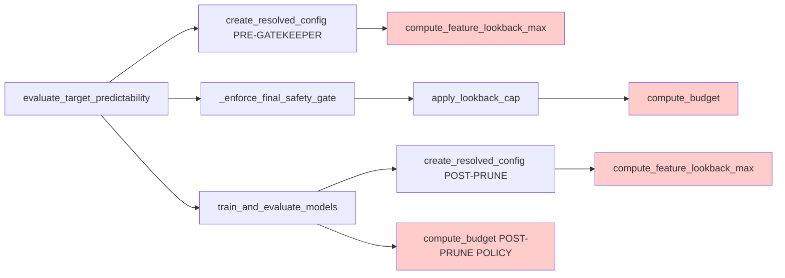

# Training Pipeline Flow Diagram

## Current Flow (With Redundancies)

**Red boxes**: Redundant recomputation  
**Green boxes**: Missing (should exist)

## Proposed Flow (With FeatureSet Artifact)

**Green boxes**: FeatureSet artifacts (single source of truth per stage)

## FeatureSet Artifact Structure

## Budget Computation Call Sites (Current)

**Red boxes**: Redundant calls (should be cached/reused)

